# How To Initialize Terraform

In this step-by-step tutorial you will learn how to initialize Terraform in a working directory.

## Prerequisites
1. Computer or laptop (Windows, Mac, Linux) with internet access
2. AWS Account with AWS CLI Authentication
3. Hashicorp Terraform installation
4. GitBash, Terminal, or PowerShell
5. Microsoft Visual Studio Code
6. Knowledge of basic Linux commands
7. Optional: GitHub account

## Windows Guide
### GUIDE 1: Open GitBash
1. Locate the GitBash icon on your Desktop. If icon is not present on your desktop, click the Windows Start button and type "GitBash" in the search.
2. Open GitBash with elevated privileges by right clicking the GitBash icon and click "Run as administrator".
3. If GitBash is open and running with admin privileges, proceed to guide 2

### GUIDE 2: Verify configuration
In these steps you will working within GitBash
1. Copy the following `curl` command below
```
curl https://raw.githubusercontent.com/aaron-dm-mcdonald/Class7-notes/refs/heads/main/101825/check.sh | bash
```
2. Paste the command into GitBash and execute it, which will verify and copy to your system the following:
	- Proper AWS configuration
	- Terraform installation
	- Class 7.0 structured assets folder
	- ".gitignore" file download in the "Terraform" folder
3. You should get a successful report as shown below. If not, you will need to resolve the issue(s) given. 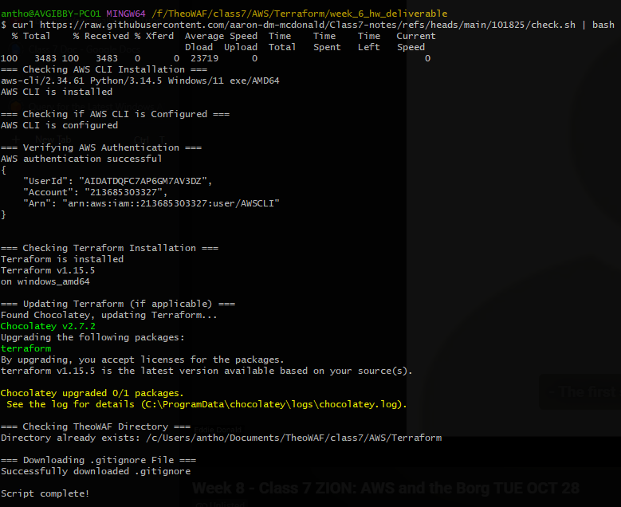
	- For both AWS CLI and Terraform failure refer to Class 7.0 Installation guild.
The `curl` should have created a folder named "TheoWAF" within your Home folder (represented by the '~\' character; lets verify)
4. Navigate to your Home folder by executing the command `cd ~` 
5. Run `pwd` to ensure you're in your Home folder
6. Execute the command `ls` to verify folder "TheoWAF" is present.
7. If so, navigate to path "~/TheoWAF/class7/AWS/Terraform/"
8. Run `pwd` to check if you are in the "Terraform" folder
9. Execute the command `ls -al ../` to list all file including hidden files.
10. Verify **.gitignore** file exist in the "Terraform" folder.

###  GUIDE 3: Create a working directory for your Terraform project 
1. While still in the "Terraform", create a directory using the `mkdir` command.
	- ex. `mkdir YourFolderName`. Replace "YourFolderName" with a name of you choosing
	- ex. `mkdir terraform-project`
2. Verify the directory's creation; run command `ls`. You should now see your newly created directory with the same you passed along with the `mkdir` command in the previous step.
3. Run command `cd YouFolderName` and navigate into you Terraform project directory. Replace "YourFolderName" with you directories name.
4. Run `pwd`, verify your in your project directory.

### GUIDE 4: Copy .gitignore file
We will now copy the **.gitignore** in the Terraform directory into your project directory.
1. Execute this command which will copy the file into you Terraform project directory, `cp ../.gitignore .`
2. Run `ls -al` to verify a copy of **.gitignore** is in your directory.

### GUIDE 5: Create a Terraform file and open VSCode
We will use the `touch` command to create a Terraform authentication file.
3. In GitBash type the command `touch 01-auth.tf`
4. Run `ls` to verify the file **01-auth.tf** is present.
5. Verify the file exist then run the command `code .` which will open VSCode on the present directory your currently in.
6. You VSCode with a similar setup in the image below.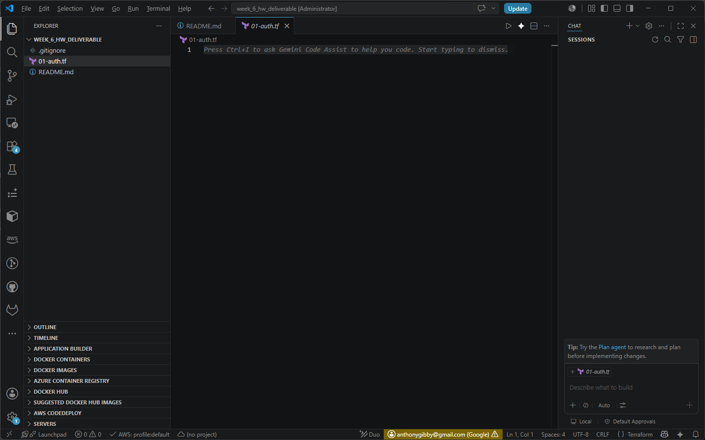
7. Ensure you see both **.gitignore** and **01-auth.tf** files in explorer panel to the left
### GUIDE 6: Create Terraform file
Now, we will copy the authentication code into **01-auth.tf**
1. In the explorer panel click the file **01-auth.tf** to open it in a tab
2. Navigate in your web browser to TheoWAF's GitHub repository. https://github.com/malgus-waf/class5/tree/main
3. If you have a GitHub account, click the "Fork" button to this repo to you account.
4. In the files listings, click the file link name **0-Auth.tf**
5. Click the button shown below to copy the code to you clipboard. WARNING: Do not highlight the text to copy 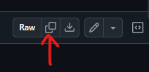
6. Head back over to VSCode
7. On line 1 paste the code from your clipboard 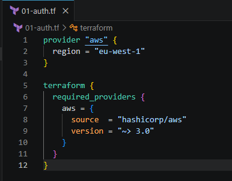
8. Save the file

### GUIDE 7:Open a GitBash instance directly in VSCode
1. In VSCode menu, click Terminal -> New Terminal, or use the keyboard shortcut CTRL+SHIFT+\`
	- Optionally, you can click the "Toggle Panel" button in the top right VSCode window or use keyboard shortcut CTRL+J. 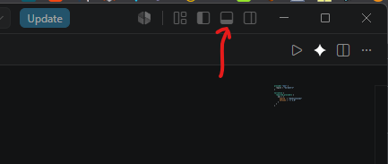
2. You should see the panel at the bottom of VSCode. 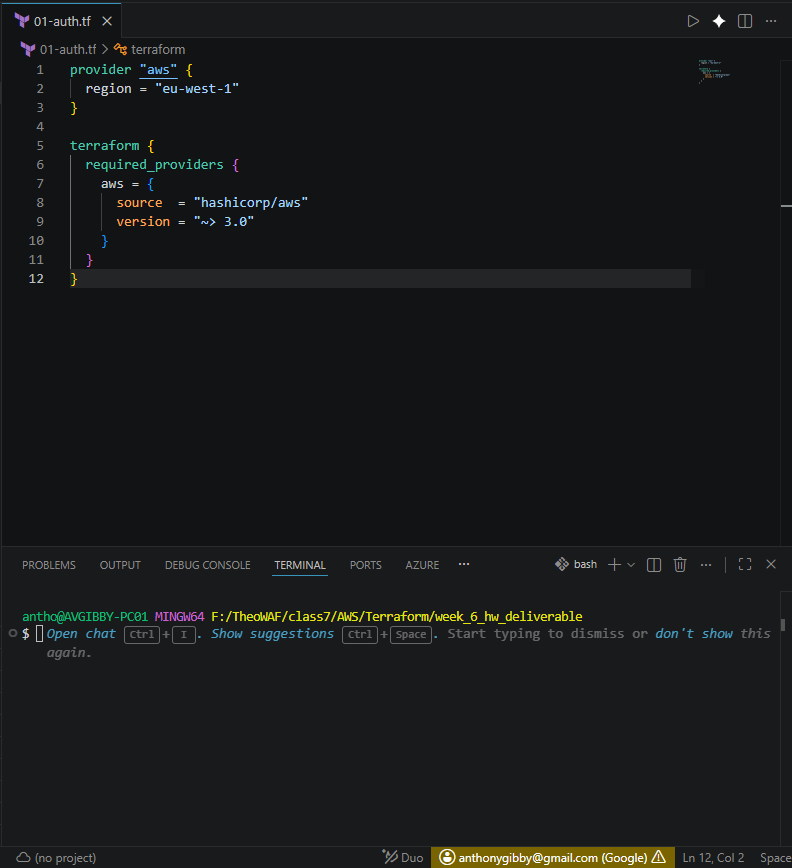
3. If another Terminal open beside GitBash, you set GitBash as the default. Click the down arrow next to the '+' button, click "Select Default Profile" in the menu that pops up 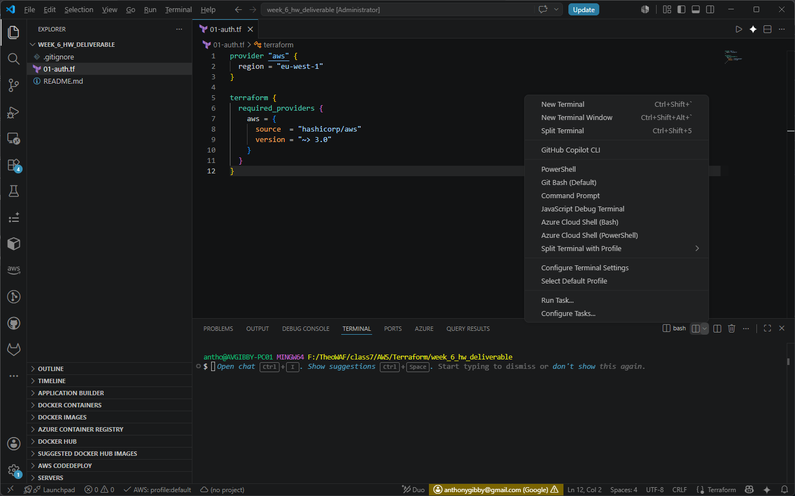
4. Next click GitBash 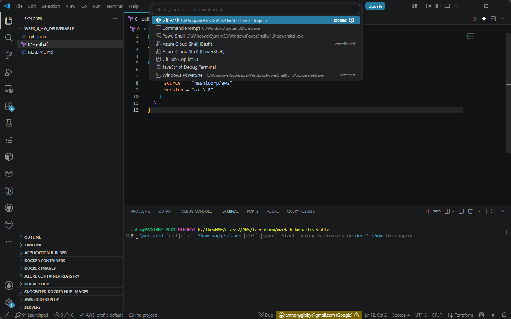
5. Now anytime you open a Terminal GitBash will open by default
6. In the new GitBash terminal window below run command `pwd` to verify you are in the project folder.
7. Type and run the Terraform command `terraform init` to initialize Terraform in your project directory. 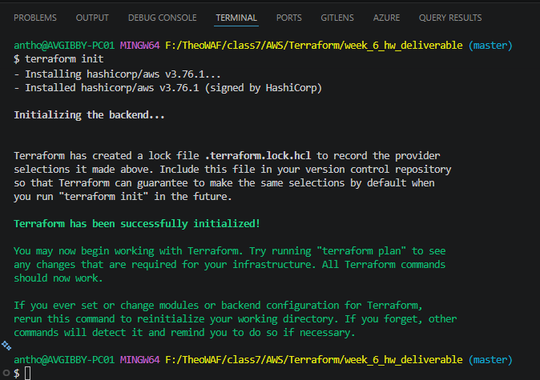
8. If successfully initialized, there will be a **.terraform** folder and a **.terraform.lock.hcl** file the explorer panel.
> [!warning]
> DO NOT ATTEMPT TO OPEN AND/OR MODIFY THE **.terraform** FOLDER AND THE **.terraform.lock.hcl** FILE

9. Run the Terraform command `terraform validate` to check syntax of the **01-auth.tf** file 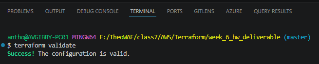
10. If successful, now run the next command `terraform plan` to create a report of the actions Terraform will perform in AWS. You should get the following status report. 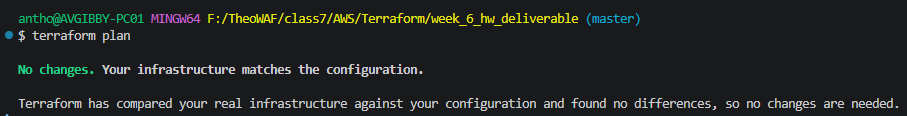
11. Now, run the command `terraform apply` 
12. The console should show the follow:
    "Apply complete! Resources: 0 added, 0 changed, 0 destroyed." 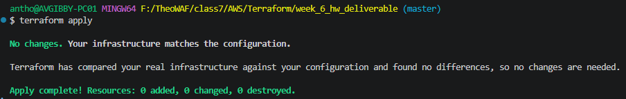
13. Congratulations! You have successfully initialized a Terraform in a folder the will work with the AWS platform

> [!warning]
> UNDER NO CIRCUMSTANCES SHOULD YOU EVER MODIFY THE FOLLOWING FILES/FOLDERS:
> 2.  **.terraform** folder 
> 3. **.terraform.lock.hcl** file
> 4. **terraform.tfstate** file